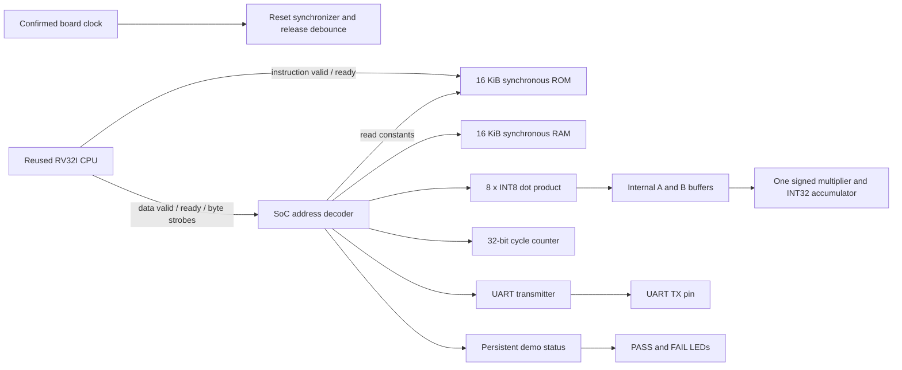

# Architecture

The diagram's blocks all use the same clock. Reset assertion is asynchronous;
release passes through two synchronizer stages and a stable-low debounce interval.
External reset is the only physical button input. The wrapper requires active-high
reset; a confirmed active-low board button needs an explicit board-level inversion.
Assert reset after programming before using the demonstrations.

The original CPU's request/response protocol already supports synchronous memory.
Instruction fetch takes FETCH_REQ, FETCH_RSP, EXECUTE cycles in this SoC. Loads also
use DATA_REQ/DATA_RSP; stores finish at the acceptance edge. No CPU RTL was changed.
The bus returns a registered response for every accepted read, including holes.
Requests remain stable under test backpressure. Write strobes select RAM byte lanes;
peripheral writes require all four lanes. Read size is handled in the CPU LSU.

The accelerator uses `busy` as its two-state FSM encoding. It reads one pair of
internal bytes per cycle; the inputs cannot change while busy. There is one signed
8x8 multiplication operator and a separately sign-extended 32-bit accumulation.
The product of index 7 is assigned into the result on the last cycle. The completed
result persists during later input writes and the next operation.

Both ROM ports and the RAM read port are synchronous. Runtime reset does not clear
the memories or their read-output registers, permitting block RAM inference. The
16-entry input buffers and the CPU register file intentionally use registers.
`firmware/hex/*_rom.hex` contains executable code, constants, and the ROM load image
of `.data`; `*_ram.hex` initializes RAM to zero. Startup copies `.data` and clears
BSS on every reset. Memory words and firmware are little-endian.

The stack starts at `0x00014000` and grows down in a reserved 4 KiB region. Linker
assertions keep static data below `0x00013000`, and the CPU integration test monitors
stack placement. The firmware uses no heap, libc, OS, interrupts, DMA, custom
instructions, or multiplication/counter CSRs.

`fpga_top` exposes only `clk`, `external_reset`, `uart_tx_pin`, and three LEDs:
LED 0 busy (may be too brief to see), LED 1 persistent firmware PASS, LED 2 firmware
FAIL or CPU trap. No program/data arrays or debug buses appear at package pins.
